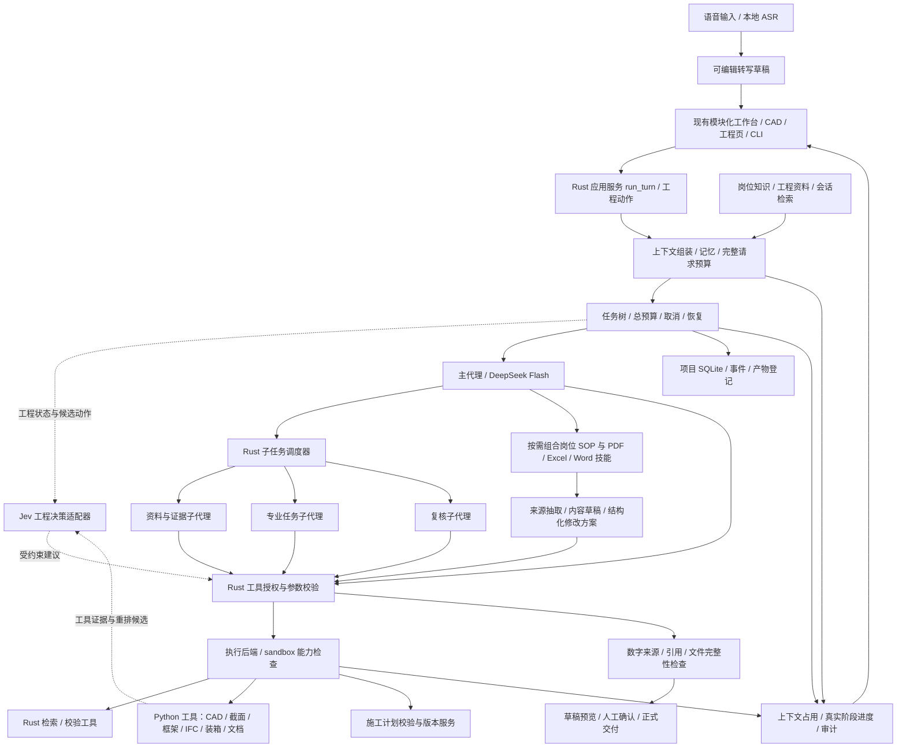

# Civil Buddy：Rust 土木工作台架构设计

> 后续实现记录：本文保留设计时的源码盘点与历史验证。2026-09-21 的实际实现、测试证据及未覆盖能力见 [implementation.md](implementation.md)；文末“尚未实现”描述的是设计快照。

设计日期：2026-09-21。修订版 v0.5：在已有 Agent 基础设施上增加共享 PDF、Excel、Word 读改技能、文档修改协议，以及 LLM/Jev 参与跨文件工程任务的具体流程。

核对基线（均为早期开发工作中的提交，已在本仓库历史中）：已合并的会话/事件基线 head `8ab5677`、merge `279da2c`，当时 main `b3ccc72`；前端模块化分支 head `f328693`；CAD 与工程分支 head `3e93025`。后两项核对时尚未合并。下文的 PR55、PR56、PR57、PR58 是这些早期开发分支的简称，不是本仓库的 PR 编号。主目录 main 仍在 `40ba86c`；CAD 工作区本轮另有 planning/routing 的未提交修改及新文件，本文读改能力仍以固定提交 `3e93025` 为准，未将进行中的其他开发算作已验证能力。本轮未修改、切换或合并项目源码。

状态：可用于分工和实现的设计稿。已做固定版本源码核对和部分现有离线回归，没有实现新 Rust 运行时、使用 API Key 或执行真实模型验收。现有能力须结合所属分支阅读；拟议接口、模块和迁移步骤是目标规格。

修订判断：PR #55 已完成事件回放、落盘状态、附件归并与后台任务；`b3ccc72` 让 Web 的非协作、非含混 model/auto 路径复用 `run_turn`。PR #56 已拆出八个前端模块；PR #58 已有 CAD 证据与版本链、截面/梁框架/IFC 计算、施工计划和可终止 worker。当前主要问题是分支尚未汇合、上下文与存储边界未统一、工程工具仅部分接入 Agent。迁移应围绕已有实现收口。详见第 15–17 节。

## 1. 核心决策

采用一个 Rust 模块化单体，统一 Web、CLI 和未来桌面入口。Rust 管理任务、权限、状态、预算和文件交付；DeepSeek Flash 承担资料理解、跨文件对应、内容起草、修改方案、工具参数建议和复核解释；Jev 工程决策适配器对明确的工程语义问题作受约束判断；确定性工具负责计算、结构化读写、文件修改与验收。

Agent 基础设施是共享底座：输入通道 → 上下文组装与 RAG → 主/子代理 → 授权策略 → 隔离执行 → 事件、记忆和产物。sandbox、上下文占用、任务执行进度、语音和检索均已有部分实现，不能在 Rust 迁移时丢失。[Agent 基础设施详细设计](civil-buddy-agent-infra.md) 给出当前源码、目标接口、平台限制和验收条件。

共享文档技能与 66 岗位 SOP 组合使用：岗位定义要完成什么工程任务，PDF/Excel/Word 技能定义怎样读取、修改和验证文件。当前代码已有文字读取、新建导出和部分模板/草稿页更新，但缺少通用结构化编辑工具；`run_skill` 还明确排除了模型拟写内容。v0.5 将“有来源的模型草稿与修改补丁”作为明确新增路径，详见 [文档技能与 LLM/Jev 工程工作流](civil-buddy-document-skills.md)。这是目标设计变更，尚未注册到运行时。

首期只配置 DeepSeek 也应完成闭环。Jev 工程决策适配器先进入影子模式，记录建议但不改变执行路径；有本项目评测证据后再开启辅助决策。

已有 Python 装箱、Office、CAD、sectionproperties、Pynite、IfcTester/IfcDiff 通过窄工具协议复用，施工计划保留现有校验与版本语义。Team A/B 的领域阶段、有界优化内环和数值规则也保留。Rust 接管统一调度后，不调用旧的整套通用 Python agent_loop 管理同一个任务；迁移期按能力选择单一执行后端。Python 内部可以组织求解阶段，但不另建用户会话、审批和通用子代理调度中心。

## 2. 整体结构



图中的子代理是可选择的执行角色，首期最多同时运行两个。所有箭头上的执行行为都由 Rust 调度，模型只返回建议和工具请求。

图中上下文占用表示单次模型请求的估算输入与回复预留，任务进度表示实际阶段/工具/子任务状态；总调用预算是第三种计量。语音先成为可编辑输入，参数面板可直接调用领域服务，二者都不绕过授权。Jev 使用同一预算、来源与观测接口，不创建另一套基础设施。

## 3. Jev、LLM、Agent、Skill、Tool 的边界

| 对象 | 负责什么 | 输入输出边界 |
|---|---|---|
| Rust Runtime | 驱动任务状态机、执行授权、预算、取消、持久化 | 接受任务与用户操作，输出可追踪事件和真实产物记录 |
| DeepSeek Flash | 理解工程资料、映射跨文件条目、起草内容、提出表格/文档补丁、解释结果 | 拟写文本与修改方案有独立来源和草稿状态；通过范围、事实、结构和产物检查后应用 |
| Jev 工程决策适配器 | 把工程证据转换成问题，对歧义、资料冲突和重排候选给出结构化建议 | 适配器限定问题和选项、映射返回值；不授予权限、不替代计算或专业签认 |
| Agent | 一次有目标、上下文、工具范围和预算的执行实例 | 返回结构化任务结果和证据 |
| Skill | 岗位 SOP 与通用文件操作 SOP、必需资料、可用工具和完成标准 | 岗位与能力分目录，按需组合；技能文本不能自行授予工具权限 |
| Tool | 单一可测试动作 | 明确的参数、结果、单位、来源、副作用和错误 |

66 个岗位保持为 66 份技能目录项，按任务加载少量完整 SOP。不能把岗位数量直接转换为常驻代理数量，也不把全部岗位全文塞入每个模型请求。

新增能力技能暂定 `doc-pdf`、`doc-spreadsheet`、`doc-word`、`doc-review`，不混入岗位数量。它们是 Civil Buddy 需要实现的项目内能力；当前 Codex 能使用的 PDF/Word/Excel 技能不会自动进入 Civil Buddy 产品。

Jev 的官方接口支持 Choice、Score、Noul。Choice/Score 返回置信信息，Noul 有不同返回结构；适配器应保留这些差异。类型约束不等于土木判断正确，置信度也不能直接解释成该任务的实测正确率。[官方简介](https://docs.typesafe.ai/introduction)、[置信度说明](https://docs.typesafe.ai/confidence)

## 4. 唯一任务入口

建议在现有 workbench Cargo package 内演进，先保留一个库和少量二进制入口。

```rust
// 接口示意，所引用类型由应用层定义。
async fn run_turn(
    app: &AppState,
    workspace: &WorkspaceContext,
    request: TurnRequest,
    events: EventSink,
) -> Result<TurnResult, TurnError>;
```

目标是 Web、CLI、桌面把自然语言操作转换成 TurnRequest，把参数面板操作转换成明确的 EngineeringCommand，并展示结果。两种请求共享工具、权限、运行记录与产物服务；表单计算不必绕一圈 LLM。已有 Web model/auto 的共享入口继续使用；剩余分支逐步纳入。

沿用 PR #55 的对象关系：Project 是工程，Session 是用户看到的任务/会话，Turn 是其中一次执行，Run 是领域计算及 trace，Task 是新增的内部子代理任务。后台执行仅是同一个 Session 的 Turn 没有前台读者，不再创建并列的用户可见 Thread 系统。CLI 的旧 thread ID 通过兼容映射迁移。

任务生命周期：

```text
created → routing → planning → running → validating → completed
              ↘ needs_input ↗       ↘ awaiting_approval ↗
任一执行阶段 → cancelling → cancelled
任一阶段 → failed / interrupted
```

暂停等确认时释放执行槽；恢复时重新核对资料版本、工具参数和审批作用范围。收到取消请求只表示 cancelling，等在途操作结束或 worker 确认终止后才能报告 cancelled。

优先保留现有 HTTP 契约，由 Rust 的 transport 层适配到统一服务：

| 接口 | 含义 |
|---|---|
| POST /api/chat | 保留 session_id；background=true 返回 202 和 session_id/turn_id |
| GET /api/sessions/{sid}/events | 保留 after / Last-Event-ID 续流；目标增加可选 turn_id 锚定历史轮次 |
| POST /api/sessions/{sid}/cancel | 保留显式取消，与断线分开处理 |
| GET /api/file?session=...&run=...&file=... | 保留产物逻辑引用；上传原件使用 session/upload 引用 |
| GET /api/health | 保留 capabilities，前端根据真实实现启用功能 |
| /api/cad/*、/api/engineering/* | 保留 PR58 参数面板、项目版本、计算与取消契约；适配到同一领域服务 |
| POST /api/approvals/{id}/resolve | 后续新增的细粒度确认接口，与既有确认契约兼容 |

CLI 直接调用同一个应用服务，或连接同一服务进程；不得另写第二份执行器。

## 5. Rust 模块布局和依赖

```text
workbench/
  Cargo.toml
  src/
    lib.rs
    types.rs                  # 任务、证据、工具与事件的公共类型
    app/                      # run_turn、恢复、审批与最终交付
    agents/                   # 主循环、子任务调度、预算与取消
    context/                  # 全请求预算、消息组装、裁剪、来源与压缩报告
    memory/                   # 用户陈述/工具结果/模型意见分层，摘要与重建
    retrieval/                # 入库、FTS/BM25、作用域过滤、引用解析与索引版本
    policy/                   # 工具权限、确认范围、允许路径与审计决定
    execution/                # 应用任务、OS worker、工程 worker 的统一生命周期
      sandbox/                # 平台后端、自检、实际隔离能力与环境变量最小集
    events/                   # 持久事件、SSE、阶段进度、上下文用量与 trace 关联
    input/                    # 文字/附件/语音来源；ASR 转写成为待提交草稿
    providers/                # DeepSeek / Jev / 可选 ASR 协议适配
    skills/                   # 岗位/能力双目录，按需组合、工具需求与版本记录
    documents/                # 文档 IR、补丁、差异、版本、重算/渲染与验证
    tools/                    # 工具注册、授权、执行和 worker 协议
    domains/                  # CAD / structure / BIM / schedule / packing / documents 契约
      engineering_decisions/  # Jev 工程决策适配器：证据、问题、候选和结果映射
    workspace/                # 显式工程上下文、材料与路径范围
    store/                    # SQLite、文件清单、事件恢复
    transport/                # HTTP、CLI、后续 MCP 适配
    bin/                      # 组合依赖并启动入口
demo/static/                  # 复用 PR56 modules/ 和 PR58 CAD、工程、计划页面
workers/python/               # 目标包装层；先复用已有 engineering/worker.py 的固定操作
workbench/seed.json            # 继续作为现有技能目录唯一来源
.agents/skills/               # 保留按需加载的生成 SOP
skills/document/             # 拟议共享文件技能；独立 manifest，不挤入 66 岗 seed
```

依赖方向：transport → app → agents/domains/接口；providers、store、worker 适配器实现接口；程序入口负责组合。领域计算不依赖 HTTP、聊天记录或前端组件。先用模块隔离，稳定后再按真实复用需求拆 crate。

沿用当前项目已有的 axum、tokio、reqwest、serde、rusqlite 技术基础，不为重构同时引入另一套 Agent 框架。前端采用 PR56 已完成的依赖注入模块，合入 PR58 工程入口与 CAD 上下文；Rust 按能力逐项接管既有 API。前端拆分已在进行，不能再排成从零开始的后期任务。

岗位目录继续以 workbench/seed.json 和 build_codex_expert_skills.py 为权威。拟议能力目录单独记录类型、版本、工具与依赖，不手改已生成岗位 SOP；SkillRegistry 汇总两类目录并区分岗位数、能力数及实际就绪状态。

## 6. 子代理机制

主代理判断是否值得分工。普通问答、单次查表和单工具计算直接完成；有独立材料或独立检查项时才创建子任务。

初期角色：

| 角色 | 工作 | 交付 |
|---|---|---|
| 资料与证据 | 找到相关材料、定位条款和原始数字 | EvidenceRef 列表、缺项和冲突 |
| 专业任务 | 依据岗位 SOP 调用确定性计算或比对工具 | 工具结果、单位、假设和状态 |
| 复核 | 检查引用、数字来源、遗漏和矛盾 | 问题清单及可定位依据 |

同一个 DeepSeek 模型可以承担全部角色；隔离的是上下文、工具和目标。复核角色产生检查意见，最终通过条件由 Rust 和工具结果决定。

建议初始工程限制（待实际延迟与任务样本调整）：深度 1、子任务总数最多 4、并发最多 2、主代理最多 8 次模型调用、单个子代理最多 6 次；整棵树模型调用上限 20。总输入输出 token 预算示例 64,000，执行时限示例 300 秒。整树上限优先于各代理局部上限，重试也计入预算。

预算先预留再发请求，用实际 usage 结算；并发任务不能各自以为还有完整父预算。等待人工确认不占运行槽，恢复后重新检查执行时限和授权有效性。

每个子任务获得目标、允许的资料引用、skill_id、工具白名单、独立暂存目录和共享取消信号；不复制全部聊天历史。首期子代理只允许读取和在自己的暂存区生成中间结果，由主任务负责正式发布。

子任务返回 TaskResult：status、findings、evidence、missing_inputs、conflicts、proposed_artifacts、usage。工具失败、资料不足和意见冲突均作为结果保留，不能由主代理凭文字把它们合并成成功。

## 7. Jev 工程决策适配器

这里增加的是带工程语义的领域适配层。providers/jev 只处理 HTTP、超时与供应商返回类型；domains/engineering_decisions 负责构造工程状态、决定哪些问题值得问、生成合法候选、解释返回值，并接到原 IntentSpec 与 Team A/B 阶段。

已检查的 PR55、main、PR56/58 相关运行时与工程代码中未找到现成 Jev 接入；下列是新增规格。

| 插入点 | Jev 处理的语义问题 | 原有机制继续负责 |
|---|---|---|
| 输入 → IntentSpec | 目标语义有无歧义、应澄清哪类约束 | 显式 API 参数优先、锁柜数、保留/排除物料、单位和必填项校验 |
| 材料解析后 → Team A | 原文是否存在相互冲突的描述、哪组证据需复核 | 缺尺寸/重量的硬检查、原文定位、结构计算 |
| evaluator/risk 后 → 有界重排 | 在已经合法的候选里，优先重做成箱、重排布局、补证据或交人处理 | 原 critic/planner 规则、轮次上限、成本预算、重新求解和风险检查 |
| 文书复核 | 根据给定材料，对预定义“需核对”问题作判断 | 数字来源、条款引用、文件完整性和发布规则 |
| PDF/Excel/Word 跨文件工作流 | 条款与响应是否语义对应、两个描述是否冲突、修改是否改变约定范围、候选缺项如何分类 | 来源定位、单元格/段落补丁、版本前提、公式计算、差异与渲染检查 |
| CAD 与结构资料 | 在可定位的原图标注、测量值、用户确认值之间识别需复核的语义冲突 | 原件 hash、选集版本、尺寸绑定、单位检查；荷载/材料/支座缺项由 schema 直接判断 |
| IFC 结果与计划说明 | 将工具给出的差异或依赖提醒归入预定义复核类别，选择下一步核对事项 | IDS 规则、GlobalId 对比、日期/依赖校验；不产生碰撞、强度合格或 CPM 结论 |

已由代码确定的事实不再交给 Jev 判一次。例如 can_fit=false 不需要模型确认；重量缺失直接进入待补资料。Jev 主要处理文本含义及候选之间的判断。

```text
EngineeringDecisionContext（宿主构造）
  phase + intent_spec + 用户明确约束
  已核验 facts（值、单位、来源引用）+ 原文片段
  hard_checks + 合法 candidate_actions + 剩余预算
        ↓ 工程适配器生成 Choice / Score / Noul 问题
Jev 返回问题答案、概率；Choice/Score 另有 confidence
        ↓ 适配器检查题目、类型和候选是否匹配
EngineeringDecisionProposal
  option_id / 预定义检查项结果 / abstain
  宿主附加：context_hash、问题版本、模型版本、证据映射
        ↓ Rust 校验和确定性 option→action 映射
原 Team A/B / bounded_debate / 工具重新计算
```

示例：当前工具结果显示装不下。Rust 先排除“成功交付”这个动作，再给出允许的 rebox、replan、request_input、human_review 等候选；Jev 只能选择这些候选。具体增柜上限、承载约束、间隙、数值策略仍由用户约束和原确定性规则控制，Jev 不能自由写 packing_options_delta。

Jev 本身不生成自由文本。missing_fields、可问的问题和 evidence_refs 由本地 schema、题库、原文定位及候选映射构造；不要假设 Jev 会返回任意解释段落或自己找出准确页码。DeepSeek 可以根据已登记的决策和证据向用户解释。

Rust 先解析明确岗位及结构化输入。适配器处于 off/shadow/assist：关闭时沿用原规则；影子时记录建议但不改变路径；辅助时只有通过验证的建议才进入原流程。超时、低置信度、候选过期或模型返回不匹配时，使用原确定性路线或请求澄清；权限不变。

评测应覆盖意图澄清、证据冲突和工程重排，用原流程作基线，记录错误动作率、需人工转交比例、计算成功率、延迟和整任务成本。阈值按本项目样本确定。Jev 事件进入既有 trace，并区分 decision.proposed、decision.validated、decision.rejected、replan.selected。

官方 HTTP API 可以通过现有 reqwest 对接，当前 Quick Start 使用 endpoint https://api.typesafe.ai/v1/systemone 和 model jev-latest。保存实际返回模型版本及本地问题版本。[官方接入说明](https://docs.typesafe.ai/introduction/quickstart)

## 8. DeepSeek Flash 最小接入

目前官方推荐模型 ID 为 deepseek-flash，模型页列出的底层版本是 DeepSeek-V4.1-Flash；旧 deepseek-v4-flash 名称仍可用并路由到新 Flash。不要把仓库旧默认名当成固定旧版本。[官方模型页](https://api-docs.deepseek.com/quick_start/pricing/)

首期沿用 Chat Completions，把模型协议封装在 providers/deepseek 内；领域层不接触供应商 JSON。先用非思考模式和非流式工具调用建立可检查基线，再验证思考模式与流式增量处理。[官方 API](https://api-docs.deepseek.com/api/create-chat-completion/)

拟议配置（不代表当前仓库已经支持此文件）：

```toml
[llm]
provider = "deepseek"
base_url = "https://api.deepseek.com"
model = "deepseek-flash"
api_key_env = "DEEPSEEK_API_KEY"
thinking = "disabled"
max_tokens_per_call = 2048

[engineering_decision]
provider = "jev"
mode = "off"                 # off / shadow / assist
endpoint = "https://api.typesafe.ai/v1/systemone"
model = "jev-latest"
api_key_env = "TYPESAFE_API_KEY"

[runtime]
max_parallel_children = 2
max_children = 4
max_depth = 1
max_model_calls_total = 20
max_total_tokens = 64000
execution_timeout_seconds = 300
```

密钥只在服务端读取。工具调用流程固定为：发送可用工具 schema → 收到模型 tool_calls → Rust 验证名称、JSON 参数与权限 → 执行 → 按 tool_call_id 回传结果 → 继续模型回合。非法 JSON 明确失败或受限重试，不能替换成空参数后执行。

思考模式启用前，须按当时协议核对推理字段的回传要求。流式解析需跨网络块缓存 UTF-8、SSE 和 tool-call 参数，不能把每个网络块当成完整 JSON。用户可见最终结果经统一校验后发布。

401 明确要求更新配置；429、临时网络故障和可重试服务器错误在预算内有限重试。模型不可用时明确报告；如果用户选择离线模式，则单独标明确定性执行，不能计为真实 LLM 验收通过。

## 9. 工具、权限与工程证据

ToolSpec 至少包含名称、输入/输出 schema、所需权限、副作用类别、超时、幂等策略和版本。一个名字对应一个动作，例如 parse_materials、compute_packing、draft_scheme、export_docx 分别注册、分别记录。

Rust 决定授权。模型与 Jev 返回的路径、确认标志和权限建议不能直接成为有效授权；人工确认绑定 workspace、turn、具体操作及参数摘要，变更参数后重新验证。

沿用当前产品规则：高风险写入要求既定人工确认，投标等交付保持 submit_blocked；具体工程签认属于用户的业务流程。普通只读任务不额外加确认。

每个工程事实包含值、单位、来源文件和定位、资料版本、工具版本及输入摘要。柜数、坐标、工程量和金额由工具产生；引用的条款必须回到原文。can_fit=false、缺尺寸或缺重量必须保留为失败或待补资料。

当前仓库仍限制模型拟写文本进入成稿。v0.5 显式提出新增 `DraftProposal → DocumentPatch → 校验后的新版本` 路径，让 LLM 真正起草和修改文档：文本、表结构和公式建议保留模型来源；事实/数字/条款关联原始证据；计算值仍由工具产生。普通编辑按用户已授权范围生成副本与差异，高风险工程承诺沿用具体签认流程。候选草稿可以保存并预览，不能因生成成功就称为已审定正式文件。此政策与工具链尚未在现有运行时启用。

## 10. 工作区、持久化与 Python worker

WorkspaceContext 显式携带规范化工程根、材料目录、输出目录、资料版本和权限范围；TurnContext 携带任务 ID、预算、取消信号及审批记录。共享 AppState 只保存服务依赖，不能保存唯一的“当前工程”。目录迁移保留 PR55 的“一会话一目录”，不同时重做附件、备份和下载格式。

```text
<工程目录>/
  CIVIL.md
  <用户原始材料>
  .civil-buddy/
    out/
      <session_id>/
        transcript.jsonl
        session.meta.json
        runs/
        deliverables/<run_id>/
        uploads/<upload_id>.*
        events/<turn_id>.jsonl
        events/<turn_id>.state.json
        staging/<task_id>/       # 新增子任务暂存区
    state.sqlite                # 分阶段建立统一状态索引
```

沿用既有 sessions/runs/events/audit_decisions 的存储语义，再增加 turns、tasks、tool_calls、approvals、artifacts。原本的工作台 SSE 日志和装箱领域 trace 属于两个层次，要用 session_id/turn_id/run_id/parent_task_id 映射，不能直接混成同一种 seq。

第一阶段保留 PR55 JSONL/state 文件及原回放格式；Rust 取得某个回合的单一写入所有权后再迁移到 SQLite。最终数据库是权威状态，兼容 JSONL 为可重建投影。不能让两端同时独立写同一状态，也不通过无事务双写宣称已一致。

PR55 seq 是每轮编号，事件恢复目标应绑定 session_id + turn_id + seq；旧请求继续支持，但新接口增加显式 turn_id，防止把上一轮的 after 应用到下一轮。落盘回放不等于自动继续未完成的计算。

终态、事件和租约释放要作为一个一致状态转换：先可靠提交终态，再向查询和新请求开放空闲状态。第 14 节记录了 PR55 历史基线的时序问题；后续分支已有状态处理变化，集成时应按最新组合版本回归，不能直接将旧观察当作最新缺陷。

Python 工具协议带 version、call_id、tool、session_id/turn_id/run_id、显式工作区、deadline 和 arguments。仅固定白名单程序可启动，模型不能提供 shell 命令、模块名或任意脚本。stdout 只输出协议消息，诊断走 stderr；请求与结果有大小限制。

保留已有 cancel.scope/check 检查点。PR58 ToolEngine 已在超时后发协作取消并保留仍运行工具的资源占用，不能再按 PR55 旧实现描述为单纯 join 后返回；线程依然不是强制终止。新增 engineering/worker.py 已对四种固定操作使用独立进程并在取消/超时后 kill+wait，Rust 优先接管这个边界。其他长任务逐步采用同类固定 worker；协作取消需要显式控制通道，Rust token 不会跨进程自动生效。

需要终止保证的计算在独立工作进程或严格隔离 worker 上执行。PR58 已有 ContextVar 与 copy_context 传播，但 workspace.py 仍有进程级路径注入，工程 API 也有固定存储根；显式 WorkspaceContext 应替代这些并存机制。Python 保留领域校验，Rust 接管后由 Rust 持有任务与审批权。当前 OS 沙箱会拒绝 CAD 截面工具再启动子进程，迁移需设计宿主授权的固定 worker 启动机制；策略代码与可 kill 进程均不等于完整 OS 沙箱。

产物先写 staging，Rust 校验路径、文件存在性、格式与散列后再登记发布。相同 call_id 重试不得重复发布；崩溃恢复对照调用记录和文件清单核对状态，不直接重新执行未知是否完成的写入。取消后的迟到结果可以留作诊断，不升级为正式交付。

## 11. 土木工作台界面

保留现有聊天、CAD、工程分析与施工计划页面，由统一工程上下文连接。左栏放工程、任务和资料；中间放当前工具页面或用户指令；右栏按需展示原文、CAD 选集、分析图、IFC 差异和产物预览。参数面板是确定性操作入口，聊天是可选的任务组织入口。审批在对应操作旁说明要生成或更改什么。

默认让用户选工程、上传材料和提出目标。岗位是任务辅助选择；多个子任务有清晰进度，但无需用户理解模型供应商、token 或工具协议。技术轨迹放在可展开的运行记录中。

示例任务：“检查这份装箱清单，列出缺项，并生成内部装运草稿。”

```text
读取用户指定清单
  → 资料子代理定位尺寸、重量、单位与缺项
  → Rust 校验必要字段
  → 装箱工具计算（完整输入才进入求解）
  → 复核子代理检查结果与引用
  → Rust 保留失败状态并核对数字来源
  → 需要时取得高风险操作确认
  → 模板生成草稿，登记文件，展示原始依据
```

资料缺项时先停在 needs_input，问具体缺失字段；不能用模型估值伪造完整清单。

## 12. 迁移顺序和完成条件

| 阶段 | 实施范围 | 退出条件 |
|---|---|---|
| A：汇合已有能力 | 固定 main、PR56、PR58；解决模块化前端与 CAD 上下文冲突，保存现有契约 | 一份集成基线能使用聊天/CAD/工程/计划；公共文件语义验收通过 |
| B：Rust 最小闭环 | 接完整上下文预算、检索、sandbox、事件；并列接 CAD 截面与文档读改链，保留语音入口 | Jev 关闭时真实模型完成工程工具与跨文件读改；模型拟写内容可追踪到修改补丁和实际新文件 |
| C：领域与主链扩展 | 接框架/IFC/计划/装箱/文档，收拢剩余 steps/协作路径；Jev 影子模式 | 工具数值与基线一致，决策记录可回放；状态、权限及发布只有一个写入者 |
| D：子代理与辅助决策 | 受限 spawn_task、总预算、取消、证据合并；按评测打开 Jev assist | 两个子任务与一个工程重排闭环可核验，冲突/超时/重试处理准确 |
| E：旧栈收口 | 移除被替代的通用调度和全局路径切换，按需迁移存储、同步文档发布 | 一个当前业务调度入口，保留明确的协议兼容和历史数据读取 |

各阶段是可独立验收的切片，不预设日历工期。先迁移控制流程，成熟计算库按实际收益决定是否进一步用 Rust 重写。

真实模型验收至少保存：请求时间、实际模型标识、request/turn/tool IDs、工具参数与版本、结果、token 用量、错误/重试和产物散列。使用明确可外发的测试材料；运行记录不含密钥。

首期验收清单：

1. 只有 DeepSeek 配置、Jev 关闭时，完成真实 tool_call → 工具结果 → 最终答复。
2. 固定装箱样本与现有确定性基线一致；缺重量和装不下的样本不产生成功结论。
3. CLI 与 Web 对相同结构化请求使用相同权限、工具及产物规则。
4. 两个子代理并行，预算覆盖整棵树；矛盾保留为待核对问题。
5. 父任务取消后停止新调用，在途 worker 状态可确认，迟到结果不发布。
6. 导出时重试或进程重启不重复生成正式产物。
7. Jev 超时/无凭证/低置信度不扩大权限，关闭 Jev 不影响 DeepSeek 基线闭环。
8. 两个工程的材料、上下文和输出互不混用。
9. 每次模型调用都计入系统提示、工具 schema、证据、历史和在途工具结果；超限不静默截断当前要求。
10. RAG 引用能定位到当前允许的原件版本；没有检索到适用资料时保留缺项。
11. 语音转写可校对、可取消、切换任务后不回填旧录音结果；转写本身不能授予高风险权限。
12. sandbox 报告反映真实读/写/网络/进程能力；UI 将上下文占用、步骤进度、总任务预算分别展示。
13. PDF/Excel/Word 三类文件分别完成定位读取、声明支持的修改、差异和重开验证；不把新建文件误称为原文件保真编辑。
14. 至少完成一条 PDF 要求 → Excel 对应表 → Word 修订 → 输出检查的真实模型链路，保留来源映射及未覆盖项；Jev 关闭时仍可完成。

只要真实模型没有实际发起工具调用，就不能把离线测试、模板回复或预设轨迹称为“DeepSeek 跑通”。本设计目前尚未执行以上验收。

## 13. 来源与当前实现对应

官方能力核验日期：2026-09-21。Jev 和 DeepSeek 的模型别名及 API 可能演进，应在实现时复核并锁定测试快照。

- [Jev 官方模型介绍](https://docs.typesafe.ai/introduction)：结构化问题与结果。
- [Jev 官方 Quick Start](https://docs.typesafe.ai/introduction/quickstart)：HTTP 接入与模型名称。
- [Jev 官方置信度说明](https://docs.typesafe.ai/confidence)：返回字段含义与阈值选择。
- [DeepSeek 官方模型页](https://api-docs.deepseek.com/quick_start/pricing/)：当前 Flash 名称及支持能力。
- [DeepSeek 官方 Chat Completions API](https://api-docs.deepseek.com/api/create-chat-completion/)：请求、工具调用与结果结构。

现有代码映射：workbench/Cargo.toml 提供 Rust 依赖基础；workbench/src/llm.rs 可作为供应商适配参考；runtime/turn.py 与 main 的 Web model/auto 接线作为统一回合基线。PR56 modules/ 提供前端拆分基础；PR58 cad3d/、engineering/ 提供真实领域服务，workspace_ctx.py 与 ToolEngine 提供已改进的上下文和取消行为。余下全局路径、固定存储根与两套通用调度逐步收口。

## 14. PR55 与原架构复用清单（历史基线）

本节记录 v0.2 已核对的 PR55 历史基线，不能用它覆盖 PR56/58 的后续改进。前端模块、工作区上下文、工具超时等较新的判断见第 15–17 节；PR55 定向测试观察到的竞态也仅代表该固定版本。来源链接固定到核对过的提交。

| 资产 | 已确认实现 | 采用方式与限制 |
|---|---|---|
| SSE 日志与续流 | [chat_service.py:712](../../../demo/chat_service.py)、[app.py:869](../../../demo/app.py)：seq、JSONL、SSE id、after/Last-Event-ID | 直接保留前端处理器、去重和重连行为；Rust 移植生产者并增加 turn_id 游标校验。现有写日志失败只记错误，不应直接宣称具备事务持久性 |
| 重启中断状态 | [chat_service.py:629](../../../demo/chat_service.py)：state.json、PID、heartbeat、stale | 保留中断展示和历史回放；Rust 内部 interrupted 映射到兼容状态。不得把它写成崩溃后继续执行工具 |
| 前台/后台同一任务 | [chat_service.py:873](../../../demo/chat_service.py)：同 producer、lease、turn_id，POST 返回 202 | 保留 session/turn 对象与同会话排他；Agent 子任务新增在内部 Task 层，不复活另一套用户可见 thread |
| 附件与下载引用 | [uploads.py:94](../../../demo/uploads.py)、[attach.rs:19](../../../workbench/src/attach.rs)、[app.py:956](../../../demo/app.py)：session/uploads、原件/提取文本/metadata、逻辑引用 | 数据格式、备份语义和前端引用直接保留；服务实现逐步移植，路径根换成 WorkspaceContext |
| 当前工作台交互 | [app.js:683](../../../demo/static/app.js)、[app.js:1902](../../../demo/static/app.js)：上传进度/重试、附件选择、事件恢复、任务草稿 | 保留行为与测试，具体模块边界采用 PR56；不能把已完成的产品能力缩回简单聊天框 |
| 后端能力声明 | [api.rs:297](../../../workbench/src/api.rs)：声明共享界面当前禁用的上传、取消等能力 | 保留机制，补充版本及所有能力键。新增能力缺字段按未支持处理；attachments=false 不代表没有上传代码，Rust 实际已有上传路由，需逐项验收后启用 |
| IntentSpec | [intent_spec.py:14](../../../packing_assistant/intent_spec.py)：目标、预算、锁定项、物料范围和显式优先级 | 直接保留领域契约；Jev 只补充受约束建议，不覆盖明确输入 |
| Team A/B 阶段 | [team_a.py:13](../../../packing_assistant/teams/team_a.py)、[team_b.py:13](../../../packing_assistant/teams/team_b.py)：成箱、确认、规划、装载、评估、风险、可视化 | 保留领域函数和阶段职责；由 Rust 管理用户授权及跨阶段状态。现有 Team 名称不等于多个独立 LLM 已经在协作 |
| 有界重排 | [bounded_debate.py:218](../../../packing_assistant/bounded_debate.py)：critic/planner 提案、最多两轮、复算裁决 | 原规则作为基线，Jev 从合法动作列表提出建议；保留锁柜数、参数约束和工具裁决 |
| 工具契约与审计 | [tool_contracts.py:1](../../../packing_assistant/runtime/tool_contracts.py)、[tool_engine.py:153](../../../packing_assistant/runtime/tool_engine.py) | 保留名称、输入输出约束和错误分类；迁移前冻结共享 schema，Rust 执行授权，不把 Python 线程超时复制成终止机制 |
| 内部取消检查点 | [cancel.py:27](../../../packing_assistant/runtime/cancel.py)、[big_team.py:265](../../../packing_assistant/teams/big_team.py) | 原工具检查点直接保留，新增 Rust→Python 取消控制通道；外部 Java 等在途调用的终止能力要单独验收 |
| 技能与 trace/storage | [expert_capabilities.py:26](../../../packing_assistant/expert_capabilities.py)、[trace_events.py:49](../../../packing_assistant/trace_events.py)、[storage.py:39](../../../packing_assistant/storage.py) | 复用 seed、生成技能、领域 trace schema 和 SQLite 基础，新增 Jev 决策事件与父子 ID 映射，分阶段统一写入者 |

### 必须修正的复用边界

PR55 的 [chat_service.py:909](../../../demo/chat_service.py) 在写磁盘终态之前调用 lease.finish；内层执行器也会先释放 lease。查询逻辑会将“内存不活跃、磁盘仍 running”判作 stale。定向测试观察到一次磁盘仍为 running 的断言失败，单独复跑通过。因此记录为已观察到的时序竞态，不能声称每次必现；Rust 必须将终态提交和租约释放设计成一致转换。

当前内存注册表和 PID 检查适用于单服务进程。需要多进程运行时，应引入有 owner/generation 的持久租约，不能仅把已有文件复制到共享目录就视为分布式任务系统。

原 Team A/B 包装器有 enable_auto_confirm 默认值，Rust 适配层必须按真实用户授权显式传入；不能继承旧默认值或让模型决定是否确认。

### 本轮核对与验证记录

| 范围 | 结果 | 证明范围 |
|---|---|---|
| GitHub PR55 状态 | 已合并，merge 279da2c；rust/smoke/packing-eval-slice 三项检查 SUCCESS | 远端检查记录，不代表本轮重跑全套或覆盖未来 Rust 架构 |
| PR55 前端现有行为测试 | node --test scripts/test_chat_stream.cjs：87/87 通过 | 离线脚本行为；不是手机真机或浏览器视觉验收 |
| PR55 Python 事件/后台/文件引用定向测试 | 6/7 首轮通过；终态测试首次失败，单例复跑通过 | 上述状态转换竞态已记录；不能汇总成全部通过 |
| 远端 b3ccc72 Web 模型回合测试 | scripts/test_workbench_model_turn.py：6/6 通过 | 脚本模型驱动 stream_turn 与 HTTP /api/chat 的工具及确认逻辑；不是真实 DeepSeek |
| Jev 工程决策适配器 | 仅完成设计，未实现或调用 | 与现有基线能力分开记录 |

测试运行在任务自己的代码快照中；模型凭证与 dotenv 禁用，主仓库工作分支未修改。尚未运行完整项目检查、Rust 全量编译、真实 DeepSeek/Jev 调用或用户现场资料验收。

PR55 Python 定向测试节点如下。临时目录指定在快照内的 output 下，以符合项目沙箱；外部网络阻断。失败节点为第二项，随后仅单例复跑该项并通过。

```text
demo/tests/test_interaction.py::test_turn_events_are_numbered_logged_and_resumable
demo/tests/test_interaction.py::test_turn_state_is_on_disk_and_a_restart_marks_leftovers_stale
demo/tests/test_interaction.py::test_background_turn_is_just_a_session_with_no_reader
demo/tests/test_links_and_cache.py::test_file_by_session_run_and_name
demo/tests/test_links_and_cache.py::test_index_stamps_static_links_and_static_revalidates
demo/tests/test_links_and_cache.py::test_uploads_live_in_the_session_dir_and_download_by_ref
demo/tests/test_links_and_cache.py::test_legacy_uploads_are_adopted_into_the_session_dir
```

## 15. 本地与队友更新后的资产基线

这些是多个开发分支中的已存在代码，不是已经合并好的同一产品版本。

| 位置 / 分支 | 核对版本与状态 | 对本设计的影响 |
|---|---|---|
| 本地主目录 | main `40ba86c`，相对已核对 origin/main 落后 35 个提交；有未跟踪工程文档及 outputs | 主目录的旧状态不能代表所有本地开发工作 |
| 远端 main | `b3ccc72`，已含 PR55 和共享模型回合修复 | 聊天、会话、事件与附件的稳定参考 |
| 队友的 `refactor/app-modules` 分支 | PR56 `f328693`，开放；相对 PR55 有 10 个提交 | 复用八模块前端、错误时已有产物、续流及后台任务行为 |
| 本地 CAD 工作区 | PR58 `3e93025`，已推送、开放，工作区干净 | 复用 CAD、工程工具、版本记录、计划页面及 runtime 改进 |
| `feat/post-depth-g14-kb` | PR57 `79bcb58`，开放 | 知识、意图与评测增量；不算新增工程求解器 |

本次核对过程中 PR58 从 `8359bc7` 更新到了 `3e93025`。工程层已包含在后者，不再标为未提交。队友 fork 的 main 与当前主仓库 main 没有可用的共同祖先比较；应沿已经移植到本仓历史的 PR56 分支集成，不能把 fork main 当作统一基线直接拉入。PR56 描述仍说“两个提交”，实际固定版本为十个增量提交，以源码和提交记录为准。

### 直接保留的领域模块

| 领域 | 当前实现和证据 | Rust 所需适配 |
|---|---|---|
| CAD 原件、选集与建模 | [cad3d/projects.py](../../../packing_assistant/cad3d/projects.py)：原件 hash、服务端重解析、选集、版本、项目包；[agent.py](../../../packing_assistant/cad3d/agent.py)：从宿主选中项目和用户原话取事实 | 保留 document/project/selection/revision 引用；工作区、权限、操作记录由宿主管理 |
| 截面性质 | [section.py](../../../packing_assistant/engineering/section.py)：sectionproperties，材料区/孔洞、面积/形心/惯性矩、实体来源及输入 hash；已有 `cad_section_properties` 模型工具入口 | 最小 Rust 工具闭环首先接它；保留单位、实体定位、离散误差和能力边界 |
| 梁/框架 | [frame.py](../../../packing_assistant/engineering/frame.py)：Pynite 一阶弹性分析，显式 SI 节点/约束/材料/荷载 | 新增统一工具注册及来源绑定；不推断跨度/支座/荷载，不冒充规范验算 |
| IFC 信息与版本 | [ifc.py](../../../packing_assistant/engineering/ifc.py)：IfcTester IDS 检查、IfcDiff 同 schema / GlobalId 比较 | 保留输入摘要、规则来源与失败实体；不扩大成碰撞或结构安全分析 |
| 施工计划 | [schedule.py](../../../packing_assistant/engineering/schedule.py)：日期/依赖校验、修订冲突、保存与恢复；现有 Frappe Gantt 页面 | 统一项目作用域、保存与操作事件；当前不具备完整 CPM 或资源平衡 |
| 分析记录 | [records.py](../../../packing_assistant/engineering/records.py)：输入/结果快照、摘要、版本、原子写与乐观并发 | 保留快照格式及 `expected_revision` 冲突语义；抽离对 `demo.projects` 存储辅助函数的反向依赖 |
| 固定计算 worker | [worker.py](../../../packing_assistant/engineering/worker.py)：frame/section/ifc_check/ifc_diff 四种操作、受限输入输出、120 秒默认超时、kill+wait | Rust 持有进程和取消生命周期；包装版本协议，无需另做通用脚本执行器 |

其中 CAD 截面已接模型工具；frame、IFC、计划主要接参数面板和 HTTP，仍需统一 Agent 工具注册。文档中已有的 102/102、浏览器及工程专项通过记录属于该开发分支的报告；本轮确认了源码，没有重跑全部工程验证或真实工程输入验收。

### 工作区与存储收口

现在至少有三类“项目”：聊天所属工程、CAD 项目、工程分析/计划记录。不能只因它们都叫 `project_id` 就当作同一个 ID。目标由 WorkspaceId 表示材料与权限作用域，SessionId 表示用户任务；CAD/分析/计划对象保留各自 ID，以 `DomainObjectRef { kind, id, revision }` 关联到工作区。

当前分析记录由 `OUT_ROOT/_engineering` 保存，计划使用仓库根对应的 `.civil-buddy/out/engineering/schedules`；[engineering_api.py:60](../../../demo/engineering_api.py) 可核对两种根目录。拟议 Repository 接口显式接收 WorkspaceContext，先兼容读取旧布局；保存快照仍只有一个权威写入者，SQLite 先登记索引和任务关联。验证导入/恢复后才切换写入，避免在迁移过程中复制出两份可独立修改的工程。

当前工程 `run_id` 先保存在有上限的内存 RUNS，用户保存后才形成持久分析项目。目标把计算完成、结果持久化、产物发布区分为不同状态：完成计算不能自动等价于已保存项目，取消也不能删除此前健康版本。由宿主解析原始文件和选集引用，模型只接触必要摘要与证据；不允许模型直接提交任意输出路径、伪造成功结果或修改已确认输入。

PR58 [workspace_ctx.py](../../../packing_assistant/runtime/workspace_ctx.py) 的局部上下文和 [tool_engine.py](../../../packing_assistant/runtime/tool_engine.py) 的传播/取消改进应保留。`workspace.py` 的模块路径与进程环境注入仍存在，不能由局部 ContextVar 改进推导出全项目已隔离，也没有本轮证据证明已实际串数据。

## 16. 汇合分支的顺序与验收

建议集成顺序为 main `b3ccc72` → PR56 `f328693` → PR58 `3e93025`，随后叠加 PR57 的知识/评测增量。先固定队友模块边界，再迁入你的 CAD 上下文。此处只提出顺序，本轮未执行实际合并。

只读三方合并探测发现 PR56 与 PR58 有八个公共文件重叠，两个文本冲突：`demo/static/app.js` 和 `scripts/check_project.py`。其余 CI、app.py、chat_service.py、index.html、styles.css、test_chat_stream.cjs 能自动合并的部分，仍需组合行为验收。

前端八模块直接复用：auth、toast、drafts、uploads、turn-stream、deliverables、session-watch、session-nav。PR56 相对 PR55 为 28 文件 +3812/−1177；app.js 从 4768 行变为 3902 行，拆分已发生但尚未完成。不要再把整套模块化列成未来从零实施的任务。

具体集成要求：

1. 将 PR58 的 CAD 项目选择、会话恢复、新任务清理放入 `session-nav` 及相应状态接口；将 `cad_project_id` 请求字段放入 `turn-stream`。不能整文件选择任意一侧。
2. 同时保留 main 的共享模型 `run_turn` 接线与 PR56 的 `partial_text/deliverables/deliverable_runs` 错误结果，失败时展示已完成的产物。
3. 保留旧 `session/run/file` 下载引用与所需 `file.path` 映射；新 ArtifactId 由 transport 兼容，不能直接换返回字段导致现有模块不显示文件。
4. 合并检查清单的全部有效项目。先 `npm run check`，再跑与组合改动有关的完整检查、jsdom 页面链路和 CAD/工程专项。
5. 更新发布资源白名单。PR56 的八个必需 ESM 文件和 sw.js 未纳入其发布脚本；PR58 虽补了 CAD/工程资源，仍没有这些模块。源码运行成功不能替代解压后的分发包验收。

组合验收采用一条用户路径：打开 CAD 项目 → 发起聊天工具请求 → 后台运行 → 切换会话 → 恢复原任务 → 打开结果。检查 CAD project 引用不丢失、新任务不继承旧项目、SSE 不重复、取消终态可靠。再检查工程参数面板保存/重开、上传和备份、发布包内模块加载。旧接口与新 Rust 接口分别跑同一组契约样本。

本轮新增验证：在 PR56 独立快照运行 `node --test scripts/test_modules.cjs scripts/test_chat_stream.cjs`，99/99 通过（12 模块测试 + 87 既有行为测试）。未运行新增 jsdom 集成测试或真实浏览器；三方合并探测不等于已合并或集成测试通过。PR58 最新提交远端检查核对时 rust 与 packing-eval-slice 已成功，smoke 尚在运行。

## 17. 首个可验收的 Rust + DeepSeek 切片

本节保留工程计算切片；v0.5 同时增加文档读改切片，见独立文档技能设计，不能把整个平台验收缩减为一次截面工具调用。

首个任务定为：“计算这个已选 CAD 截面的面积和惯性矩，并列出来源与缺项。”选它是因为已有 CAD 项目、确认选集、确定性求解器及模型工具入口，新增工作可集中在宿主协议与生命周期。

```text
现有 CAD 页确认原件、选集、单位
  → Rust 接收 workspace + CAD project/revision + 用户请求
  → DeepSeek Flash 请求 cad_section_properties
  → Rust 验证当前选集与权限，解析原件/配置引用
  → 固定 Python section worker 计算
  → Rust 登记 run、输入摘要、结果和来源实体
  → DeepSeek 解释已登记数值，界面可回到对应实体
  → 用户需要保存/导出时进入对应版本与交付流程
```

工具输入由宿主绑定项目引用，模型不能任选项目、填补尺寸或注入确认标志。工具结果外层统一为 `call_id / run_id / status / domain_result / evidence_refs / input_hash / tool_version / limitations`；内层复用现有 section 结果。为计算改名或转换单位不能丢失原始单位和实体出处。

Jev 首先关闭，独立验收真实 DeepSeek 工具调用；之后影子模式只对宿主构造的“是否需要复核单位/尺寸来源”“合法下一步动作”作结构化判断。已明确缺少单位直接请求补齐，不为这个硬规则多发模型请求。Jev 不生成解释段落或任意 evidence_refs；解释由 DeepSeek 基于工具证据生成。

这个切片的失败样本与成功同样重要：单位未确认、选集版本已变、求解器未安装、OS 沙箱不允许启动 worker、用户取消、计算后未保存和保存修订冲突。每种情况都需要可识别状态，不能归并成一个“运行失败”，也不能为了成功自动放松已有策略。

随后扩展成两个受限子任务：资料子代理核对来源和缺项，专业子代理在完整输入下调用求解器；主代理合并结果。确定性分析已有明确失败时立即保留失败，不让复核模型投票推翻。frame、IFC 和计划沿相同宿主协议逐个注册，保留各领域特有 schema 与版本，不建立一个无边界的通用 `execute_code` 工具。
